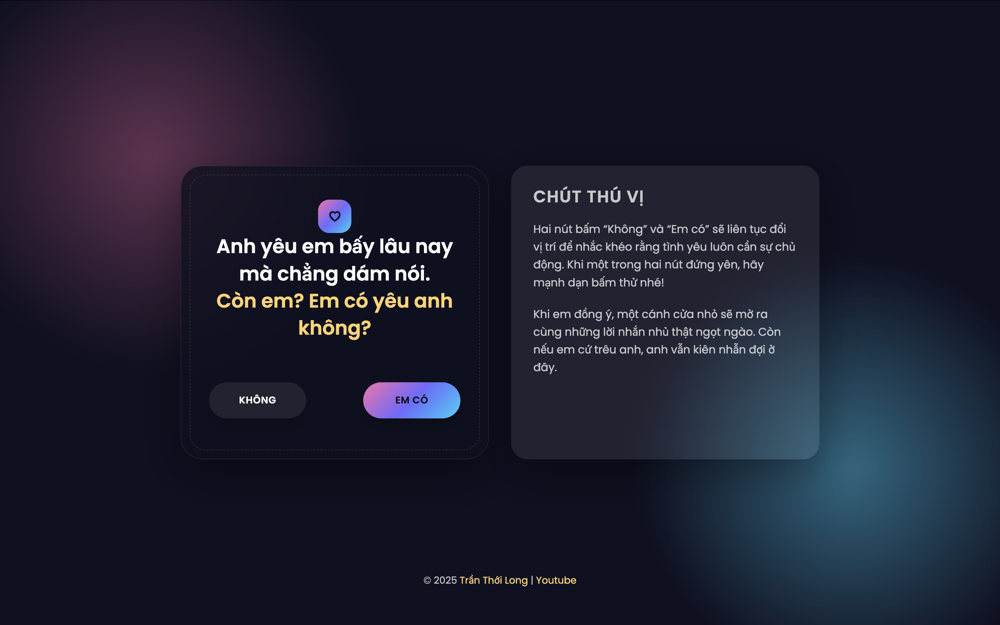
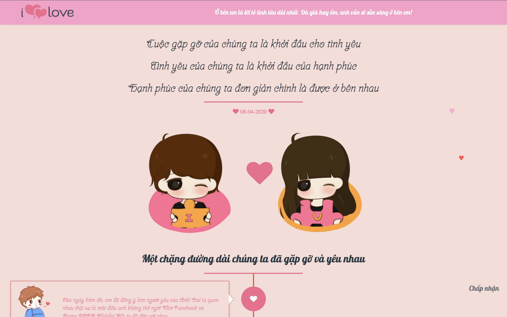
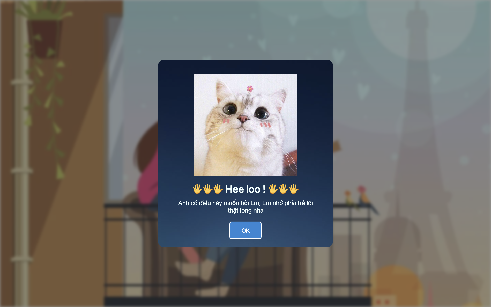

<h1 align="center">
  
</h1>

  <picture>
    <source media="(prefers-color-scheme: dark)" srcset="./logotrang.png" />
    <source media="(prefers-color-scheme: light)" srcset="./logoden.png" />
    
  </picture>

> DevOps/SRE lai Fullstack, mê tự động hóa vận hành và scale hệ thống với chi phí tối ưu.

### 🧑‍🚀 Về tôi

Tôi là [Trần Thới Long](https://octotech.vn/), DevOps engineer tự học với nền tảng fullstack. Copilot mô tả tôi là người có nhiều kinh nghiệm xây dựng web, mobile đa nền tảng và hệ thống realtime phục vụ doanh nghiệp. Tôi đam mê biến ý tưởng thành kiến trúc hạ tầng chắc chắn, dễ vận hành và đo được hiệu quả.

### 🎯 Điểm mạnh chính

- **Web hiện đại**: JavaScript/TypeScript, Vue, React, Angular cho các nền tảng quản trị và dịch vụ khách hàng.
- **Mobile đa nền tảng**: Flutter (Dart), Swift, C++ cho bài toán giao vận và điều phối tài xế.
- **Realtime & automation**: Chatbot tích hợp AI, tracking tài xế, pipeline event-driven cho vận hành realtime.
- **DevOps mạnh mẽ**: Kubernetes, GitOps, Terraform, CI/CD bảo mật, observability full-stack (Prometheus/Loki/Grafana).

### 🧭 Đang tập trung

- Tối ưu hạ tầng hybrid/multi-cloud với GitOps.
- Chuẩn hóa boilerplate DevSecOps để onboard đội kỹ thuật nhanh hơn.
- Mentor các bạn trẻ hướng DevOps/SRE, chia sẻ mindset hệ thống.

### 🛠️ Tech radar

| Layer | Công nghệ chính |
| --- | --- |
| Cloud & IaC | AWS, GCP, Terraform, Crossplane, ArgoCD |
| Platform | Kubernetes, Helm, Istio, Argo Rollouts |
| CI/CD & Security | GitHub Actions, GitLab CI, Tekton, Trivy, OPA |
| Backend & API | Node.js, NestJS, Laravel, GraphQL |
| Frontend | Vue, Nuxt, React, Next, Vite, Tailwind |
| Mobile | Flutter, Swift, C++ bridge |
| Observability | Prometheus, Loki, Tempo, Grafana, OpenTelemetry |

  

### 🚀 Dự án tiêu biểu

| Dự án | Mô tả | Vai trò |
| --- | --- | --- |
| **AutoScale Platform** | Terraform + ArgoCD tự động scale theo chi phí thực tế. | Kiến trúc sư hạ tầng, tối ưu cost/perf. |
| **Observability Stack** | Prometheus, Loki, Tempo, Grafana theo dõi realtime cho hàng trăm dịch vụ. | Thiết kế + rollout multi-cluster. |
| **DevSecOps Boilerplate** | Bộ khung CI/CD tích hợp SAST/DAST, policy-as-code, secret scanning. | Lead DevOps, build template nhân rộng. |
| **chat-bot-ai-facebook** | Chatbot AI trợ giúp chăm sóc khách hàng đa kênh. | Fullstack lead, tích hợp NLP. |
| **realtime_driver** | Hệ thống định tuyến & giám sát tài xế realtime. | Backend chính, tối ưu latency. |
| **app_driver_delivery** | Ứng dụng Flutter điều phối tài xế, tracking đơn hàng. | Kỹ sư mobile/core logic. |

### 🌐 Website đang vận hành

  

    <article style="display:flex;flex-direction:column;border-radius:16px;border:1px solid rgba(15,23,42,0.1);overflow:hidden;box-shadow:0 10px 30px rgba(15,23,42,0.08);transition:all 0.3s ease;background:linear-gradient(135deg,#fff,#fff7f0);">
      

        
        
Bản 0

      

      

        

          <h4 style="margin:0 0 8px;font-size:18px;font-weight:700;color:#1f2937;">Love Landing</h4>
          

            Hero with handwritten typography, pastel colors & subtle animations. Focused on present emotion and short commitment.
          

          

            Vue 3
            Tailwind
            GSAP
          

        

        <a href="https://tranthoilong.github.io/love-part-0/" style="display:inline-flex;align-items:center;justify-content:center;gap:8px;padding:12px 18px;border-radius:8px;background:#0ea5e9;color:#fff;text-decoration:none;font-weight:600;font-size:14px;transition:background 0.2s;cursor:pointer;">
          Visit Project →
        </a>
      

    </article>
    <article style="display:flex;flex-direction:column;border-radius:16px;border:1px solid rgba(15,23,42,0.1);overflow:hidden;box-shadow:0 10px 30px rgba(15,23,42,0.08);transition:all 0.3s ease;background:linear-gradient(135deg,#f5f5ff,#ffffff);">
      

        
        
Bản 1

      

      

        

          <h4 style="margin:0 0 8px;font-size:18px;font-weight:700;color:#1f2937;">Timeline Love Story</h4>
          

            Interactive timeline narrating journey: first meeting, calls, milestones → future promises. Storytelling + memory gallery.
          

          

            Nuxt 3
            Framer Motion
            Responsive
          

        

        <a href="https://tranthoilong.github.io/love-part-1/" style="display:inline-flex;align-items:center;justify-content:center;gap:8px;padding:12px 18px;border-radius:8px;background:#6366f1;color:#fff;text-decoration:none;font-weight:600;font-size:14px;transition:background 0.2s;cursor:pointer;">
          View Timeline →
        </a>
      

    </article>
    <article style="display:flex;flex-direction:column;border-radius:16px;border:1px solid rgba(15,23,42,0.1);overflow:hidden;box-shadow:0 10px 30px rgba(15,23,42,0.08);transition:all 0.3s ease;background:linear-gradient(135deg,#f0f9ff,#ffffff);">
      

        
        
Bản 2

      

      

        

          <h4 style="margin:0 0 8px;font-size:18px;font-weight:700;color:#1f2937;">Journey Interactive</h4>
          

            Enhanced with parallax, scroll animations & rich interactivity. From first meeting → lifelong commitment. Gallery + micro-interactions.
          

          

            React
            Scroll Trigger
            Canvas API
          

        

        <a href="https://tranthoilong.github.io/love-part-2/" style="display:inline-flex;align-items:center;justify-content:center;gap:8px;padding:12px 18px;border-radius:8px;background:#14b8a6;color:#fff;text-decoration:none;font-weight:600;font-size:14px;transition:background 0.2s;cursor:pointer;">
          Explore Journey →
        </a>
      

    </article>
    <article style="display:flex;flex-direction:column;border-radius:16px;border:1px solid rgba(15,23,42,0.1);overflow:hidden;box-shadow:0 10px 30px rgba(15,23,42,0.08);transition:all 0.3s ease;background:linear-gradient(135deg,#fef2f2,#ffffff);">
      

        
        
Bản 3

      

      

        

          <h4 style="margin:0 0 8px;font-size:18px;font-weight:700;color:#1f2937;">Counter & Love Letter</h4>
          

            Minimalist counter tracking days together with romantic love letter. Ambient audio backdrop, emotional focus, real-time counter.
          

          

            Next.js
            Web Audio API
            PWA Ready
          

        

        <a href="https://tranthoilong.github.io/love-part-3/" style="display:inline-flex;align-items:center;justify-content:center;gap:8px;padding:12px 18px;border-radius:8px;background:#ec4899;color:#fff;text-decoration:none;font-weight:600;font-size:14px;transition:background 0.2s;cursor:pointer;">
          Start Counting →
        </a>
      

    </article>

  

### 📈 Số liệu & fun stuff

  
 

 
  

  

  

  

### ☕ Liên hệ & cộng đồng

  
  
  
  

> Nếu bạn đang xây dựng sản phẩm cần scale nhanh nhưng vẫn gọn nhẹ, cứ nhắn tôi. Cà phê đen luôn sẵn sàng ☕

